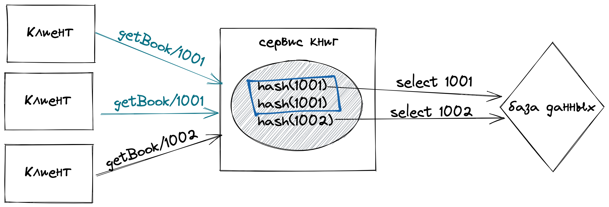
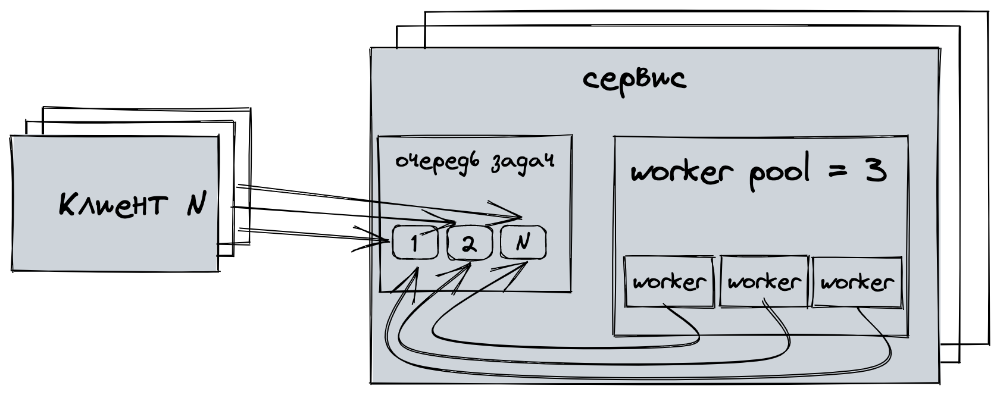
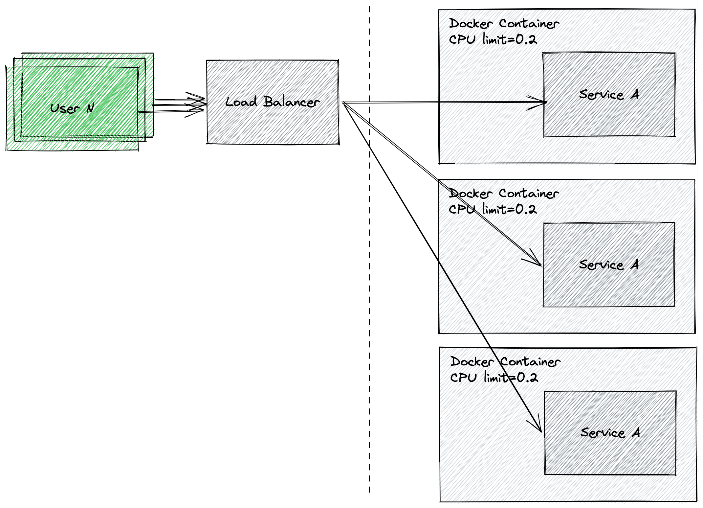
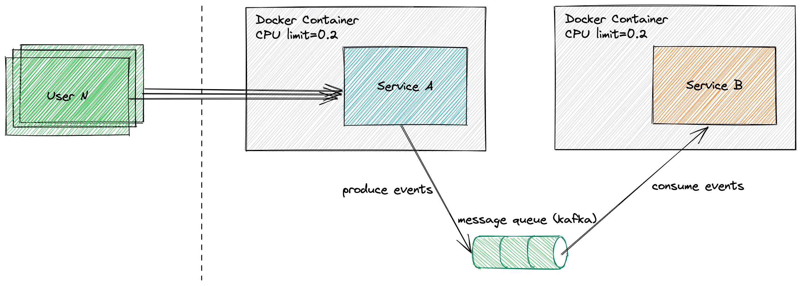
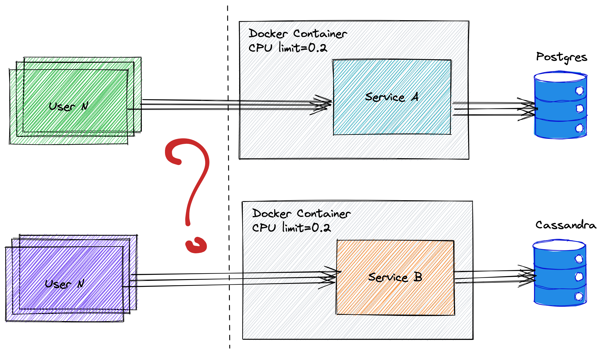

# highload-patterns

List of patterns to handle high load easily

- [Refresh-ahead caching](#refresh-ahead-caching)
- [Do once, return it to everyone](#do-once-return-it-to-everyone)
- [Worker pool](#worker-pool)
- [Stateless horizontal scaling](#stateless-horizontal-scaling)
- [Sync to async](#sync-to-async)
- [SQL to NoSQL](#sql-to-nosql)

Articles
- [Habr: Simple highload patterns in Go](https://habr.com/ru/post/682618/)
- [Habr: Medium highload patterns in Go](https://habr.com/ru/post/684904/)


### Refresh-ahead caching
Caching data in app and update in background


Figure out [example](./refresh-ahead/main.go)

```
curl --location --request GET 'localhost:8890/getPopularMovies'
```

> More details about caching on [system-design-primer](https://github.com/donnemartin/system-design-primer#refresh-ahead)

### Do once, return it to everyone

Making work once by calculating and syncing by work hash


Figure out [example](./singleflight/main.go)

> curl --location --request GET 'localhost:8890/getBook/100'

## Worker pool

Preparing worker pool for parallel execution


Figure out [example](./worker-pool/main.go)

> curl --location --request GET 'localhost:8890/handle'


## Stateless horizontal scaling

Scaling application horizontally with load balancing could be better solution if you reach server CPU/RAM/etc limits


Figure out examples [with one instance](./scale-stateless/one-instance/docker-compose.yml) and [with three instances + load balancer](./scale-stateless/multiple-with-lb/docker-compose.yml)

#### Benchmark one-instance

> docker run --network=one-instance_backend --rm skandyla/wrk -t1 -c1 -d5s http://app:8890/handle
> 
> docker run --network=one-instance_backend --rm skandyla/wrk -t3 -c3 -d5s http://app:8890/handle

Results

```shell
Running 5s test @ http://app:8890/handle
  1 threads and 1 connections
  Thread Stats   Avg      Stdev     Max   +/- Stdev
    Latency    22.55ms   28.32ms  91.44ms   78.73%
    Req/Sec   169.56     47.70   410.00     78.00%
  854 requests in 5.05s, 93.41KB read
Requests/sec:    169.08
Transfer/sec:     18.49KB

Running 5s test @ http://app:8890/handle
  3 threads and 3 connections
  Thread Stats   Avg      Stdev     Max   +/- Stdev
    Latency    45.85ms   42.16ms 195.06ms   31.70%
    Req/Sec    25.06     15.04    99.00     70.75%
  377 requests in 5.06s, 41.23KB read
Requests/sec:     74.56
Transfer/sec:      8.16KB
```

#### Benchmark multiple instances with load balancer

> docker run --network=multiple-with-lb_backend --rm skandyla/wrk -t1 -c1 -d5s http://ngnix-server:8891/handle
> 
> docker run --network=multiple-with-lb_backend --rm skandyla/wrk -t3 -c3 -d5s http://ngnix-server:8891/handle

Results

```shell
Running 5s test @ http://app:8890/handle
  1 threads and 1 connections
  Thread Stats   Avg      Stdev     Max   +/- Stdev
    Latency    22.55ms   28.32ms  91.44ms   78.73%
    Req/Sec   169.56     47.70   410.00     78.00%
  854 requests in 5.05s, 93.41KB read
Requests/sec:    169.08
Transfer/sec:     18.49KB

Running 5s test @ http://app:8890/handle
  3 threads and 3 connections
  Thread Stats   Avg      Stdev     Max   +/- Stdev
    Latency    45.85ms   42.16ms 195.06ms   31.70%
    Req/Sec    25.06     15.04    99.00     70.75%
  377 requests in 5.06s, 41.23KB read
Requests/sec:     74.56
Transfer/sec:      8.16KB
```

## Sync to async

Doing complex work asynchronously using message queue


Figure out examples [without message queue](./sync-to-async/sync/docker-compose.yml) and [with message queue](./sync-to-async/async/docker-compose.yml)

#### Benchmark without message queue

> docker run --network=sync_backend --rm skandyla/wrk -t1 -c1 -d5s http://app:8890/handle
> 
> docker run --network=sync_backend --rm skandyla/wrk -t3 -c3 -d5s http://app:8890/handle

Results

```shell
Running 5s test @ http://app:8890/handle
  1 threads and 1 connections
  Thread Stats   Avg      Stdev     Max   +/- Stdev
    Latency    28.20ms   29.85ms  90.45ms   77.06%
    Req/Sec    56.42     13.52   117.00     66.00%
  283 requests in 5.02s, 35.38KB read
Requests/sec:     56.35
Transfer/sec:      7.04KB

Running 5s test @ http://app:8890/handle
  3 threads and 3 connections
  Thread Stats   Avg      Stdev     Max   +/- Stdev
    Latency   105.07ms   64.37ms 204.37ms   54.17%
    Req/Sec    10.07      4.48    20.00     65.49%
  144 requests in 5.05s, 18.00KB read
Requests/sec:     28.53
Transfer/sec:      3.57KB
```

#### Benchmark with message queue

> docker run --network=async_backend --rm skandyla/wrk -t1 -c1 -d5s http://app:8890/handle
>
> docker run --network=async_backend --rm skandyla/wrk -t3 -c3 -d5s http://app:8890/handle

Results

```shell
Running 5s test @ http://app:8890/handle
  1 threads and 1 connections
  Thread Stats   Avg      Stdev     Max   +/- Stdev
    Latency    21.24ms   26.03ms  89.19ms   78.94%
    Req/Sec   121.16     36.59   316.00     86.00%
  610 requests in 5.05s, 66.72KB read
Requests/sec:    120.80
Transfer/sec:     13.21KB

Running 5s test @ http://app:8890/handle
  3 threads and 3 connections
  Thread Stats   Avg      Stdev     Max   +/- Stdev
    Latency    40.31ms   37.91ms 103.10ms   68.19%
    Req/Sec    29.21     13.37    90.00     83.33%
  441 requests in 5.03s, 48.23KB read
Requests/sec:     87.66
Transfer/sec:      9.59KB
```

## Sql to NoSQL

Use the right storage for your data, this can be efficient


Figure out examples [postgres](./sql-to-nosql/sql/docker-compose.yml) and [cassandra](./sql-to-nosql/nosql/docker-compose.yml)

#### Benchmark with postgres

> docker run --network=sql_backend --rm skandyla/wrk -t1 -c1 -d5s http://app:8890/handle
> 
> docker run --network=sql_backend --rm skandyla/wrk -t3 -c3 -d5s http://app:8890/handle

Results

```shell
Running 5s test @ http://app:8890/handle
  1 threads and 1 connections
  Thread Stats   Avg      Stdev     Max   +/- Stdev
    Latency     2.50ms    2.91ms  31.13ms   88.86%
    Req/Sec   524.24    143.19   760.00     80.00%
  2611 requests in 5.01s, 385.02KB read
Requests/sec:    521.43
Transfer/sec:     76.89KB

Running 5s test @ http://app:8890/handle
  12 threads and 12 connections
  Thread Stats   Avg      Stdev     Max   +/- Stdev
    Latency    42.74ms   40.28ms 199.19ms   78.80%
    Req/Sec    27.36     16.36    90.00     56.57%
  1623 requests in 5.02s, 239.33KB read
Requests/sec:    323.08
Transfer/sec:     47.64KB
```

#### Benchmark with cassandra

> docker run --network=nosql_backend --rm skandyla/wrk -t1 -c1 -d5s http://app:8890/handle
>
> docker run --network=nosql_backend --rm skandyla/wrk -t3 -c3 -d5s http://app:8890/handle

Results

```shell
Running 5s test @ http://app:8890/handle
  1 threads and 1 connections
  Thread Stats   Avg      Stdev     Max   +/- Stdev
    Latency     2.81ms  806.39us  14.13ms   91.44%
    Req/Sec   357.46     53.13   505.00     82.00%
  1782 requests in 5.01s, 262.78KB read
  Socket errors: connect 0, read 0, write 0, timeout 1
Requests/sec:    355.75
Transfer/sec:     52.46KB

Running 5s test @ http://app:8890/handle
  12 threads and 12 connections
  Thread Stats   Avg      Stdev     Max   +/- Stdev
    Latency    18.74ms   22.30ms 177.19ms   80.58%
    Req/Sec   101.73     30.50   222.00     74.12%
  6103 requests in 5.03s, 0.88MB read
Requests/sec:   1213.30
Transfer/sec:    178.91KB
```