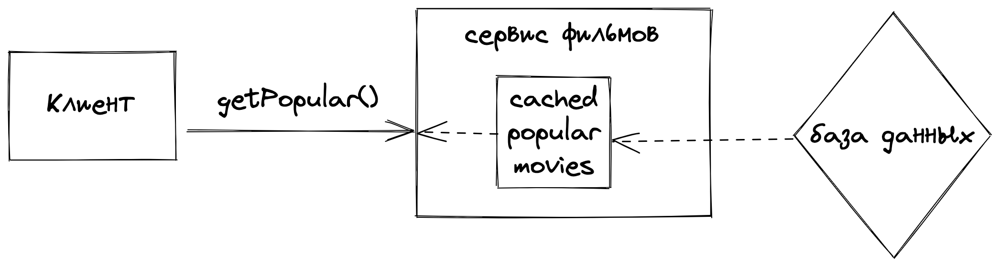

# highload-patterns

List of patterns to handle high load easily

### Refresh-ahead caching

Figure out [example](./refresh-ahead/main.go)

> More details about caching on [system-design-primer](https://github.com/donnemartin/system-design-primer#refresh-ahead)

### Worker pool

### Singleflight (prevent duplicate working)